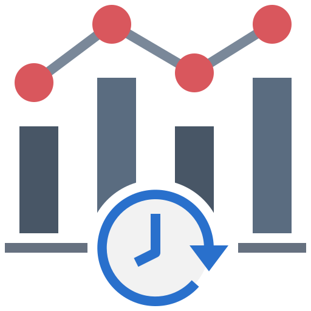
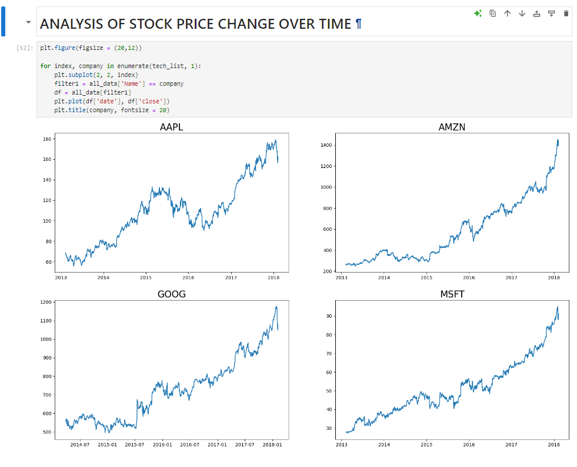
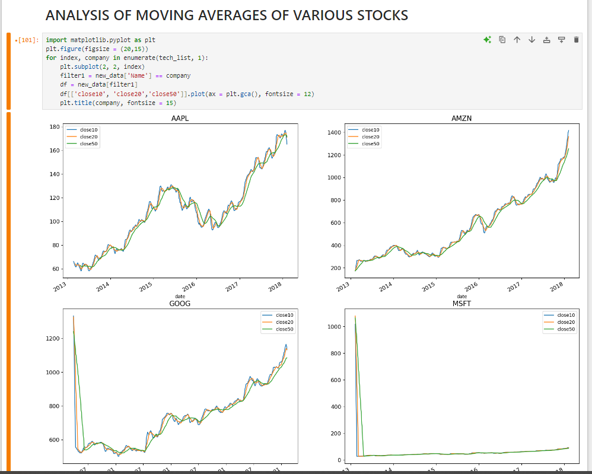
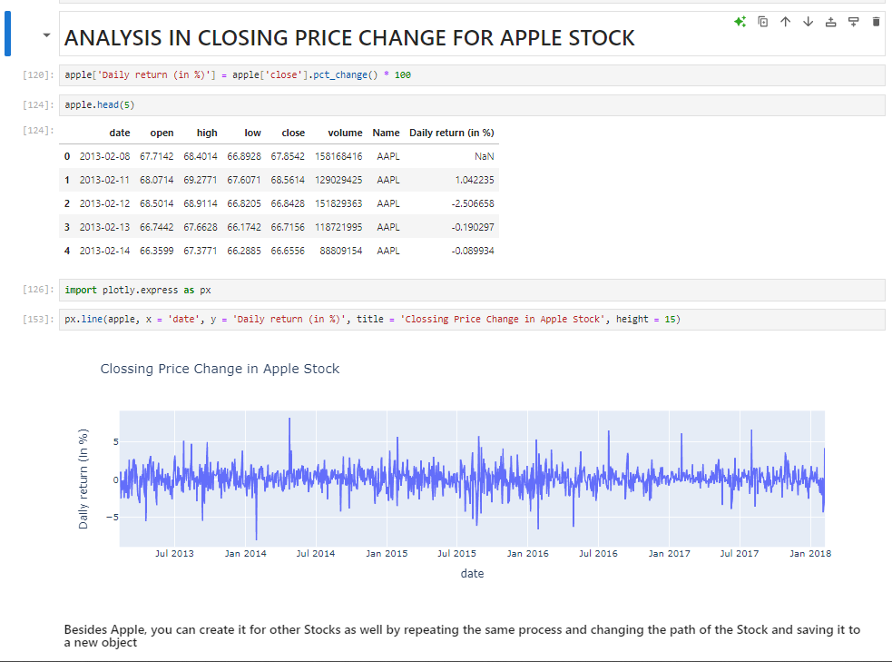
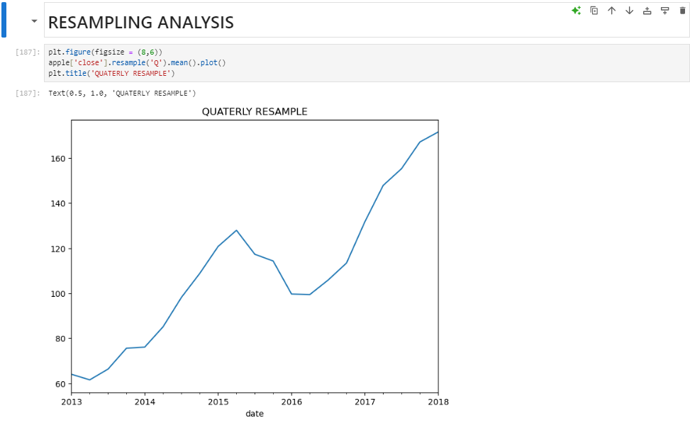
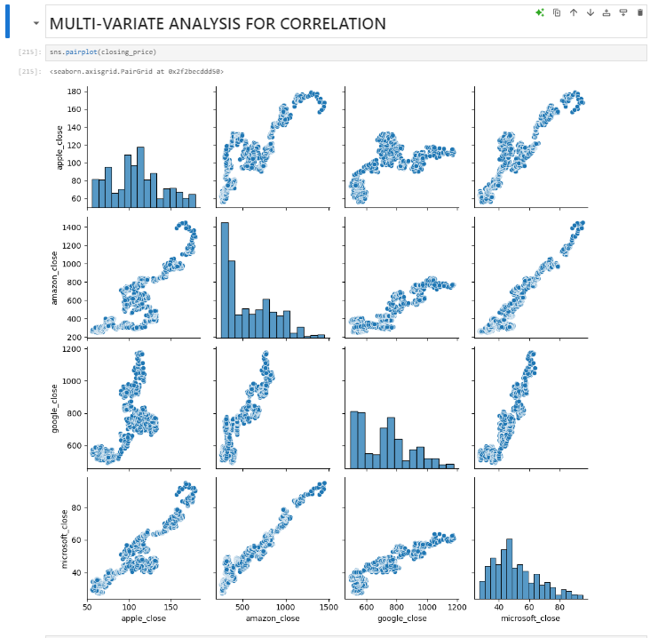
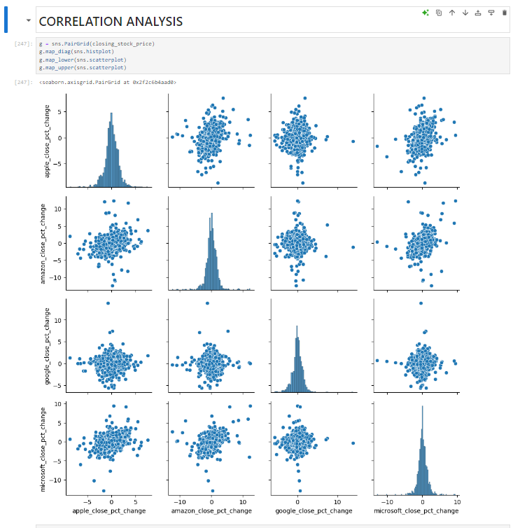
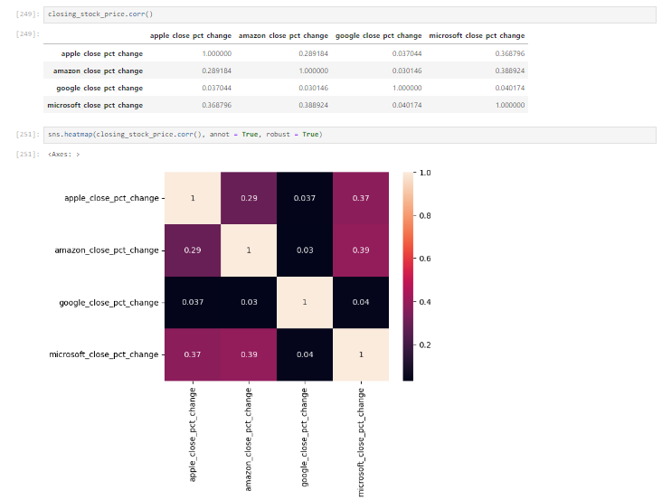

#  Time Analysis
## Description
Conducted in-depth time series analysis on stock market data for major tech companies like Amazon, Google, Apple, and Microsoft.
Utilized multivariable analysis to explore the inter-relationship between stock closing prices and daily % return,
visualized findings using Seaborn library, and performed value at risk calculations for each company. 

## Screenshots

     
     

     
     

     
     

     
     

## Tech Stack

